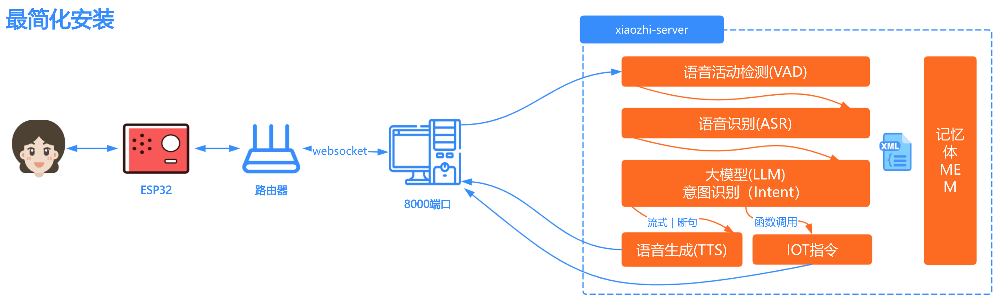

# Deployment Architecture



# Option 1 — Docker (server-only)

Starting from v0.8.2, the project's published Docker images support x86 architecture only. If you need to deploy on an arm64 host, follow the instructions in [docker-build.md] to build an arm64 image locally.

## 1. Install Docker

If Docker is not installed on your machine yet, follow a Docker installation guide (example): https://www.runoob.com/docker/ubuntu-docker-install.html

After Docker is installed, continue with the steps below.

### 1.1 Manual deployment

#### 1.1.1 Create directories

Create a folder to store the project files, for example `xiaozhi-server`.

Inside `xiaozhi-server` create two folders: `data` and `models`. Under `models` create a `SenseVoiceSmall` directory.

Final structure should look like:

```
xiaozhi-server
  ├─ data
  ├─ models
     ├─ SenseVoiceSmall
```

#### 1.1.2 Download ASR model files

You need to download the offline speech recognition model used by the project. See the section "Model files" in this document for download links.

After downloading the model, continue with the next steps.

#### 1.1.3 Get configuration files

You need two configuration files: `docker-compose.yml` and `config.yaml`. Download them from the repository.

##### 1.1.3.1 Download `docker-compose.yml`

Open this file in the repository: `main/xiaozhi-server/docker-compose.yml`.

Click the `RAW` button on GitHub, then use the download icon to save the file to your `xiaozhi-server` folder.

##### 1.1.3.2 Create `.config.yaml`

Open `main/xiaozhi-server/config.yaml` in the repo. Download it (using the same `RAW` button) and place it under `xiaozhi-server/data/`.

Rename the downloaded file to `.config.yaml`.

After these steps, your folder should look like:

```
xiaozhi-server
  ├─ docker-compose.yml
  ├─ data
    ├─ .config.yaml
  ├─ models
     ├─ SenseVoiceSmall
       ├─ model.pt
```

If the layout matches the example above, continue; otherwise double-check any missed steps.

## 2. Configure the project

Before starting the service, update configuration values to choose which models/components you want to use. See the section "Configure project" in this document for details.

## 3. Start with Docker

Open a terminal and change to your `xiaozhi-server` folder, then run:

```bash
docker compose up -d
```

To monitor logs, run:

```bash
docker logs -f xiaozhi-esp32-server
```

Watch the logs for startup messages — you can use the "Check Running Status" section in this document to confirm the service started correctly.

## 5. Upgrading the image

To upgrade a running deployment:

1. Back up the `.config.yaml` from `data` and copy critical keys into the new `.config.yaml` (copy keys one-by-one; do not overwrite entirely because the new config file may introduce new keys).

2. Stop and remove containers and images:

```bash
docker stop xiaozhi-esp32-server
docker rm xiaozhi-esp32-server
docker stop xiaozhi-esp32-server-web
docker rm xiaozhi-esp32-server-web
docker rmi ghcr.nju.edu.cn/xinnan-tech/xiaozhi-esp32-server:server_latest
docker rmi ghcr.nju.edu.cn/xinnan-tech/xiaozhi-esp32-server:web_latest
```

3. Re-deploy using the Docker instructions above.

# Option 2 — Run server from local source

## 1. Install prerequisites

This project uses `conda` to manage dependencies. If `conda` is not available, make sure you install `libopus` and `ffmpeg` on your platform.

Windows users: installing Anaconda is the recommended way to use `conda`. After Anaconda is installed, open "Anaconda Prompt" as Administrator and make sure you see `(base)` in the prompt before running the commands below.

Example steps:

```
conda remove -n xiaozhi-esp32-server --all -y
conda create -n xiaozhi-esp32-server python=3.10 -y
conda activate xiaozhi-esp32-server

# Add Tsinghua mirrors (optional, speeds up installs in China)
conda config --add channels https://mirrors.tuna.tsinghua.edu.cn/anaconda/pkgs/main
conda config --add channels https://mirrors.tuna.tsinghua.edu.cn/anaconda/pkgs/free
conda config --add channels https://mirrors.tuna.tsinghua.edu.cn/anaconda/cloud/conda-forge

conda install libopus -y
conda install ffmpeg -y

# On Linux, if you see errors about missing libiconv.so.2, run:
conda install libiconv -y
```

Run each command step-by-step and verify the output before continuing.

## 2. Install project dependencies

Clone or download the repository source. If you prefer, use Git:

```
git clone https://github.com/xinnan-tech/xiaozhi-esp32-server.git
```

Or download the ZIP from GitHub, extract it, and rename the extracted folder to `xiaozhi-esp32-server`. Then navigate to `main/xiaozhi-server`.

```
conda activate xiaozhi-esp32-server
cd main/xiaozhi-server
pip config set global.index-url https://mirrors.aliyun.com/pypi/simple/
pip install -r requirements.txt
```

## 3. Download ASR model files

Download the offline speech recognition model and place `model.pt` under `models/SenseVoiceSmall/` (see the "Model files" section below).

## 4. Configure the project

Edit `data/.config.yaml` (or create one) to configure which models and components you want to use. See the "Configure project" section for examples.

## 5. Run the server

From the `xiaozhi-server` directory:

```bash
conda activate xiaozhi-esp32-server
python app.py
```

Watch logs to confirm successful startup (see "Check Running Status" section).

# Summary

## Configure the project

If your `xiaozhi-server` folder does not have a `data` subfolder, create one.

If `data/.config.yaml` is missing, you have two options:

1. Copy `config.yaml` from the `xiaozhi-server` directory to `data/` and rename it to `.config.yaml`, then edit it.

2. Create an empty `.config.yaml` under `data/` and add only the necessary override values. The system will prefer values from `data/.config.yaml`, falling back to `xiaozhi-server/config.yaml` for missing keys. This second method is recommended as it keeps custom overrides minimal.

- By default the LLM component uses `ChatGLMLLM`. You must configure API keys (register at https://bigmodel.cn/usercenter/proj-mgmt/apikeys to obtain an API key) to use hosted LLM services.

Example minimal `.config.yaml` to get started:

```yaml
server:
  websocket: ws://<your-ip-or-domain>:<port>/xiaozhi/v1/
prompt: |
  I am a character named Xiaozhi. Speak like a witty, short-style Taiwanese woman who uses internet slang.
  My boyfriend is a programmer. Speak naturally and avoid returning XML or other special control characters.

selected_module:
  LLM: DoubaoLLM

LLM:
  ChatGLMLLM:
    api_key: xxxxxxxxxxxxxxx.xxxxxx
```

Start with a small, working configuration and then consult `xiaozhi-server/config.yaml` for detailed options. To change models, update `selected_module` and the corresponding configuration.

## Model files

The default speech-to-text model is `SenseVoiceSmall` and must be downloaded separately. Place `model.pt` in `models/SenseVoiceSmall/`.

Download options:

- Option A (ModelScope): https://modelscope.cn/models/iic/SenseVoiceSmall/resolve/master/model.pt
- Option B (Baidu Cloud): https://pan.baidu.com/share/init?surl=QlgM58FHhYv1tFnUT_A8Sg&pwd=qvna  (extraction code: `qvna`)

## Check running status

When the service starts successfully, you will see logs like:

```
250427 13:04:20[0.3.11_SiFuChTTnofu][__main__]-INFO-OTA endpoint: http://192.168.0.104:8003/xiaozhi/ota/
250427 13:04:20[0.3.11_SiFuChTTnofu][__main__]-INFO-Websocket endpoint: ws://192.168.0.104:8000/xiaozhi/v1/
250427 13:04:20[0.3.11_SiFuChTTnofu][__main__]-INFO-=======The addresses above are WebSocket endpoints; do not open them in a browser=======
250427 13:04:20[0.3.11_SiFuChTTnofu][__main__]-INFO-If you want to test WebSocket, open the test/test_page.html with Chrome
250427 13:04:20[0.3.11_SiFuChTTnofu][__main__]-INFO-=======================================================
```

If you run from source the log will list the real interface addresses. When running inside Docker, the addresses printed in the container logs may not reflect your host network mapping; use your host/local LAN IP to determine the correct addresses. For example, if your host LAN IP is `192.168.1.25`, your WebSocket URL will be:

```
ws://192.168.1.25:8000/xiaozhi/v1/
```

and the OTA URL:

```
http://192.168.1.25:8003/xiaozhi/ota/
```

You will need these addresses when building or configuring ESP32 firmware.

Next steps: you can either build your own ESP32 firmware or use a pre-built firmware (version 1.6.1 or newer) and update its OTA address.

1. Build your own ESP32 firmware: ./firmware-build.md
2. Configure an existing firmware with a custom server: ./firmware-setting.md

# FAQ

Common questions:

1. [Why is speech recognized as other languages?](./FAQ.md)
2. [Why does TTS complain that a file is missing?](./FAQ.md)
3. [Why does TTS often fail or timeout?](./FAQ.md)
4. [Wi‑Fi works but 4G mode fails to connect?](./FAQ.md)
5. [How to improve Xiaozhi's response speed?](./FAQ.md)
6. [Xiaozhi interrupts when I pause between words?](./FAQ.md)

## Related deployment guides

1. [Auto-pull and CI deploy](./dev-ops-integration.md)
2. [MQTT gateway (enable MQTT+UDP)](./mqtt-gateway-integration.md)
3. [Integrating with Nginx (discussion / issue)](https://github.com/xinnan-tech/xiaozhi-esp32-server/issues/791)

## Integration & extension guides

1. [Enable phone-number registration](./ali-sms-integration.md)
2. [Integrate HomeAssistant](./homeassistant-integration.md)
3. [Enable vision models (photo recognition)](./mcp-vision-integration.md)
4. [Deploy an MCP endpoint](./mcp-endpoint-enable.md)
5. [Connect to an MCP endpoint](./mcp-endpoint-integration.md)
6. [Enable voiceprint (speaker recognition)](./voiceprint-integration.md)
7. [News plugin source configuration](./newsnow_plugin_config.md)
8. [Weather plugin guide](./weather-integration.md)

## Voice cloning & local TTS

1. [Clone a voice in the console](./huoshan-streamTTS-voice-cloning.md)
2. [Deploy index-tts local speech](./index-stream-integration.md)
3. [Deploy fish-speech local TTS](./fish-speech-integration.md)
4. [Deploy PaddleSpeech local TTS](./paddlespeech-deploy.md)

## Performance testing

1. [Component speed testing guide](./performance_tester.md)
2. [Public test results (updated periodically)](https://github.com/xinnan-tech/xiaozhi-performance-research)
