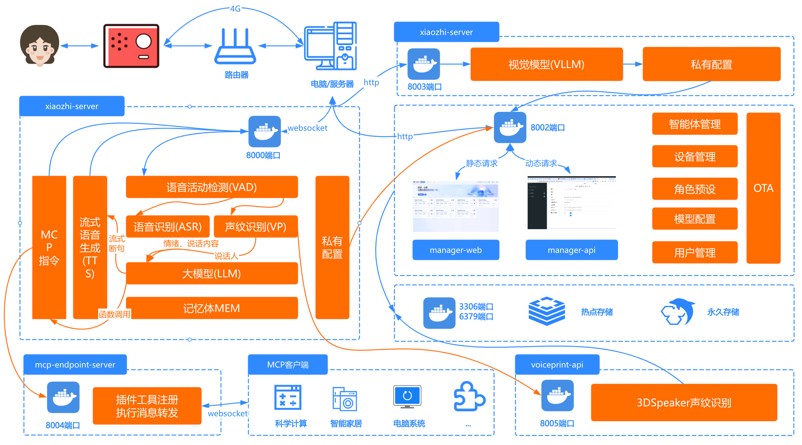

# Deployment Architecture (full modules)



# Option 1 — Docker (full-module deployment)

Starting from v0.8.2, the project's published Docker images support x86 architecture only. If you need to deploy on an arm64 host, follow the instructions in [docker-build.md] to build an arm64 image locally.

## 1. Install Docker

If Docker is not installed, follow a Docker installation guide (example): https://www.runoob.com/docker/ubuntu-docker-install.html

There are two ways to deploy the full stack with Docker: (A) use the convenience script ("lazy script") or (B) follow the manual deployment steps. The lazy script is maintained by @VanillaNahida and automates most steps; see section 1.1. For full control, use the manual steps in section 1.2.

### 1.1 Convenience script (recommended for quick setup)

This is the simplest way to deploy on a fresh Ubuntu server. See the video walkthrough: https://www.bilibili.com/video/BV17bbvzHExd/

> NOTE: The script currently targets Ubuntu servers. Other OSes may not be fully supported and could encounter issues.

Connect to your server via SSH and run the script as root:

```bash
sudo bash -c "$(wget -qO- https://ghfast.top/https://raw.githubusercontent.com/xinnan-tech/xiaozhi-esp32-server/main/docker-setup.sh)"
```

The script will automatically:

1. Install Docker
2. Configure image mirrors
3. Pull required images
4. Download speech-recognition model files
5. Guide you through basic server configuration

After the script completes and you finish the guided configuration, follow the steps in sections **4. Run the services** and **5. Restart xiaozhi-esp32-server** to finalize the three critical configuration items needed to use the stack.

### 1.2 Manual deployment

#### 1.2.1 Create directories

Create a folder to hold the server files, for example `xiaozhi-server`.

Under `xiaozhi-server` create `data` and `models` directories, and inside `models` create a `SenseVoiceSmall` folder. Final structure:

```
xiaozhi-server
  ├─ data
  ├─ models
     ├─ SenseVoiceSmall
```

#### 1.2.2 Download ASR model files

The project uses the `SenseVoiceSmall` model for offline speech recognition. Download `model.pt` and place it under `models/SenseVoiceSmall/`.

Download options:

- Option A (ModelScope): https://modelscope.cn/models/iic/SenseVoiceSmall/resolve/master/model.pt
- Option B (Baidu Cloud): https://pan.baidu.com/share/init?surl=QlgM58FHhYv1tFnUT_A8Sg&pwd=qvna  (extraction code: `qvna`)

#### 1.2.3 Get configuration files

You will need `docker-compose_all.yml` and `config_from_api.yaml` from the repository.

##### 1.2.3.1 Download `docker-compose_all.yml`

Open `main/xiaozhi-server/docker-compose_all.yml` in the repo, click `RAW`, and download the file to your `xiaozhi-server` folder.

Or use wget:

```bash
wget https://raw.githubusercontent.com/xinnan-tech/xiaozhi-esp32-server/refs/heads/main/main/xiaozhi-server/docker-compose_all.yml
```

##### 1.2.3.2 Download and prepare `config_from_api.yaml`

Open `main/xiaozhi-server/config_from_api.yaml`, download it, and place it into `xiaozhi-server/data/`.

Rename the file to `.config.yaml` (the leading dot is important).

After these steps your folder should look like:

```
xiaozhi-server
  ├─ docker-compose_all.yml
  ├─ data
    ├─ .config.yaml
  ├─ models
     ├─ SenseVoiceSmall
       ├─ model.pt
```

If your layout matches the example above, proceed to the next sections.

## 2. Backup important data

If you previously ran the admin console (manager-web) and have important keys or configuration stored there, export or copy those values before upgrading or re-deploying, because some steps may overwrite previously stored data.

## 3. Remove previous images and containers

From the `xiaozhi-server` directory, run:

```bash
docker compose -f docker-compose_all.yml down

docker stop xiaozhi-esp32-server
docker rm xiaozhi-esp32-server

docker stop xiaozhi-esp32-server-web
docker rm xiaozhi-esp32-server-web

docker stop xiaozhi-esp32-server-db
docker rm xiaozhi-esp32-server-db

docker stop xiaozhi-esp32-server-redis
docker rm xiaozhi-esp32-server-redis

docker rmi ghcr.nju.edu.cn/xinnan-tech/xiaozhi-esp32-server:server_latest
docker rmi ghcr.nju.edu.cn/xinnan-tech/xiaozhi-esp32-server:web_latest
```

## 4. Run the services

Start the new stack:

```bash
docker compose -f docker-compose_all.yml up -d
```

Monitor the admin console logs:

```bash
docker logs -f xiaozhi-esp32-server-web
```

When you see logs like the example below, the admin console (manager-web) has started successfully:

```
2025-xx-xx 22:11:12.445 [main] INFO  c.a.d.s.b.a.DruidDataSourceAutoConfigure - Init DruidDataSource
2025-xx-xx 21:28:53.873 [main] INFO  xiaozhi.AdminApplication - Started AdminApplication in 16.057 seconds (process running for 17.941)
http://localhost:8002/xiaozhi/doc.html
```

Note: At this point only the admin console may be running; if the WebSocket server (port 8000) reports errors, it may be due to later configuration steps not yet completed.

Open the admin console at http://127.0.0.1:8002 and register the first user. The first user is the super administrator; subsequent users are regular users. Super admins can manage models, users, and configuration parameters.

Next, complete three important steps (described below).

### Important step #1 — set `manager-api` secret

Log in to the admin console as the super admin. Go to **Parameters** and find the item with code `server.secret`. Copy its parameter value.

`server.secret` is used by the server to authenticate with `manager-api` — the value is generated when the manager module is first deployed.

Open `xiaozhi-server/data/.config.yaml` and set the `manager-api` block as follows:

```yaml
manager-api:
  url: http://xiaozhi-esp32-server-web:8002/xiaozhi
  secret: <paste-your-server.secret-here>
```

(When running in Docker, the `manager-api` URL should point to `http://xiaozhi-esp32-server-web:8002/xiaozhi`.)

### Important step #2 — configure LLM API keys

In the admin console, go to **Model Configuration** -> **LLM** and edit the first item (e.g., the `智谱AI` entry). Paste your registered API key into the `API Key` field and save.

### 5. Restart `xiaozhi-esp32-server`

From the shell run:

```bash
docker restart xiaozhi-esp32-server
docker logs -f xiaozhi-esp32-server
```

When the server starts successfully you should see logs like:

```
25-02-23 12:01:09[core.websocket_server] - INFO - Websocket address: ws://xxx.xx.xx.xx:8000/xiaozhi/v1/
25-02-23 12:01:09[core.websocket_server] - INFO - =======The address above is a WebSocket endpoint; do not open it in a browser=======
25-02-23 12:01:09[core.websocket_server] - INFO - To test WebSocket, open the test/test_page.html file in Chrome
25-02-23 12:01:09[core.websocket_server] - INFO - =======================================================
```

Because you deployed the full stack, you must record two important endpoints for your ESP32 devices:

OTA endpoint:

```
http://<your-host-lan-ip>:8002/xiaozhi/ota/
```

WebSocket endpoint:

```
ws://<your-host-lan-ip>:8000/xiaozhi/v1/
```

### Important step #3 — register the endpoints in the admin console

1. In the admin console, under **Parameters**, set `server.websocket` to your WebSocket endpoint.
2. Under **Parameters**, set `server.ota` to your OTA endpoint.

After this, you can proceed to configure your ESP32 devices. You may either build your own ESP32 firmware or use a pre-built firmware (v1.6.1+).

1. Build your own ESP32 firmware: ./firmware-build.md
2. Configure pre-built firmware with a custom server: ./firmware-setting.md

# Option 2 — Run the full stack from local source

## 1. Install MySQL

If MySQL is already installed locally, create a database named `xiaozhi_esp32_server`:

```sql
CREATE DATABASE xiaozhi_esp32_server CHARACTER SET utf8mb4 COLLATE utf8mb4_unicode_ci;
```

If you do not have MySQL, run it via Docker:

```bash
docker run --name xiaozhi-esp32-server-db -e MYSQL_ROOT_PASSWORD=123456 -p 3306:3306 -e MYSQL_DATABASE=xiaozhi_esp32_server -e MYSQL_INITDB_ARGS="--character-set-server=utf8mb4 --collation-server=utf8mb4_unicode_ci" -e TZ=Asia/Shanghai -d mysql:latest
```

## 2. Install Redis

Run Redis via Docker if needed:

```bash
docker run --name xiaozhi-esp32-server-redis -d -p 6379:6379 redis
```

## 3. Run `manager-api` (Java backend)

3.1 Install JDK 21 and set JAVA_HOME

3.2 Install Maven and set MAVEN_HOME

3.3 In your IDE (e.g., VS Code), install Java development extensions and import the `manager-api` module.

Edit `src/main/resources/application-dev.yml` to set the database credentials:

```yaml
spring:
  datasource:
    username: root
    password: 123456
```

Edit `src/main/resources/application-dev.yml` to set Redis connection info:

```yaml
spring:
    data:
      redis:
        host: localhost
        port: 6379
        password:
        database: 0
```

3.5 Start the Spring Boot application by running the `AdminApplication` main method:

```
src/main/java/xiaozhi/AdminApplication.java
```

When you see startup logs similar to the example below, `manager-api` is running:

```
2025-xx-xx 22:11:12.445 [main] INFO  c.a.d.s.b.a.DruidDataSourceAutoConfigure - Init DruidDataSource
2025-xx-xx 21:28:53.873 [main] INFO  xiaozhi.AdminApplication - Started AdminApplication in 16.057 seconds (process running for 17.941)
http://localhost:8002/xiaozhi/doc.html
```

## 4. Run `manager-web` (admin console)

4.1 Install Node.js

4.2 In your IDE, open the `manager-web` module, then:

```
cd main/manager-web
npm install
npm run serve
```

If your `manager-api` is not running on `http://localhost:8002`, edit `main/manager-web/.env.development` during development to point to the correct API host.

After startup, open the admin console at http://127.0.0.1:8001 and register the first user (super admin). The super admin must then configure the LLM API key (see step 3 earlier).

## 5. Install Python environment

This project uses `conda` to manage Python dependencies. If you can't use conda, install `libopus` and `ffmpeg` manually.

Windows users: install Anaconda, open Anaconda Prompt as Administrator, and ensure you see `(base)` in the prompt before running the steps below.

```
conda remove -n xiaozhi-esp32-server --all -y
conda create -n xiaozhi-esp32-server python=3.10 -y
conda activate xiaozhi-esp32-server

# Optional: add Tsinghua mirrors to speed up package downloads (China)
conda config --add channels https://mirrors.tuna.tsinghua.edu.cn/anaconda/pkgs/main
conda config --add channels https://mirrors.tuna.tsinghua.edu.cn/anaconda/pkgs/free
conda config --add channels https://mirrors.tuna.tsinghua.edu.cn/anaconda/cloud/conda-forge

conda install libopus -y
conda install ffmpeg -y

# On Linux, if you see missing libiconv.so.2, run:
conda install libiconv -y
```

Run each command step-by-step and verify success before proceeding.

## 6. Install project Python dependencies

Clone or download the repository and navigate to `main/xiaozhi-server`:

```
conda activate xiaozhi-esp32-server
cd main/xiaozhi-server
pip config set global.index-url https://mirrors.aliyun.com/pypi/simple/
pip install -r requirements.txt
```

## 7. Download ASR model files

Download `SenseVoiceSmall` model and place `model.pt` under `models/SenseVoiceSmall/` (see section 1.2.2 for links).

## 8. Configure the project

In the admin console, copy the `server.secret` value as described earlier, then create `xiaozhi-server/data/.config.yaml` (if missing) and set:

```yaml
manager-api:
  url: http://127.0.0.1:8002/xiaozhi
  secret: <your-server.secret>
```

## 5. Run the server (from source)

From the `xiaozhi-server` directory:

```bash
conda activate xiaozhi-esp32-server
python app.py
```

If you see logs like the example below, the server started successfully:

```
25-02-23 12:01:09[core.websocket_server] - INFO - Server is running at ws://xxx.xx.xx.xx:8000/xiaozhi/v1/
25-02-23 12:01:09[core.websocket_server] - INFO - =======The address above is a WebSocket endpoint; do not open it in a browser=======
25-02-23 12:01:09[core.websocket_server] - INFO - To test WebSocket, open the test/test_page.html file in Chrome
25-02-23 12:01:09[core.websocket_server] - INFO - =======================================================
```

Because you run the full stack locally, you must record the two endpoints and write them into the admin console (Parameters):

OTA endpoint:

```
http://<your-host-lan-ip>:8002/xiaozhi/ota/
```

WebSocket endpoint:

```
ws://<your-host-lan-ip>:8000/xiaozhi/v1/
```

These values affect WebSocket address issuance and OTA update behavior in the admin console.

After these steps, you can proceed to work with your ESP32 devices. See:

1. Build your own ESP32 firmware: ./firmware-build.md
2. Configure pre-built firmware with a custom server: ./firmware-setting.md

# FAQ

Common questions:

1. [Why is speech recognized as other languages?](./FAQ.md)
2. [Why does TTS complain that a file is missing?](./FAQ.md)
3. [Why does TTS often fail or timeout?](./FAQ.md)
4. [Wi‑Fi works but 4G mode fails to connect?](./FAQ.md)
5. [How to improve Xiaozhi's response speed?](./FAQ.md)
6. [Xiaozhi interrupts when I pause between words?](./FAQ.md)

## Related deployment guides

1. [Auto-pull and CI deploy](./dev-ops-integration.md)
2. [MQTT gateway (enable MQTT+UDP)](./mqtt-gateway-integration.md)
3. [Integrating with Nginx (discussion / issue)](https://github.com/xinnan-tech/xiaozhi-esp32-server/issues/791)

## Integration & extension guides

1. [Enable phone-number registration](./ali-sms-integration.md)
2. [Integrate HomeAssistant](./homeassistant-integration.md)
3. [Enable vision models (photo recognition)](./mcp-vision-integration.md)
4. [Deploy an MCP endpoint](./mcp-endpoint-enable.md)
5. [Connect to an MCP endpoint](./mcp-endpoint-integration.md)
6. [Enable voiceprint (speaker recognition)](./voiceprint-integration.md)
7. [News plugin source configuration](./newsnow_plugin_config.md)
8. [Weather plugin guide](./weather-integration.md)

## Voice cloning & local TTS

1. [Clone a voice in the console](./huoshan-streamTTS-voice-cloning.md)
2. [Deploy index-tts local speech](./index-stream-integration.md)
3. [Deploy fish-speech local TTS](./fish-speech-integration.md)
4. [Deploy PaddleSpeech local TTS](./paddlespeech-deploy.md)

## Performance testing

1. [Component speed testing guide](./performance_tester.md)
2. [Public test results (updated periodically)](https://github.com/xinnan-tech/xiaozhi-performance-research)
