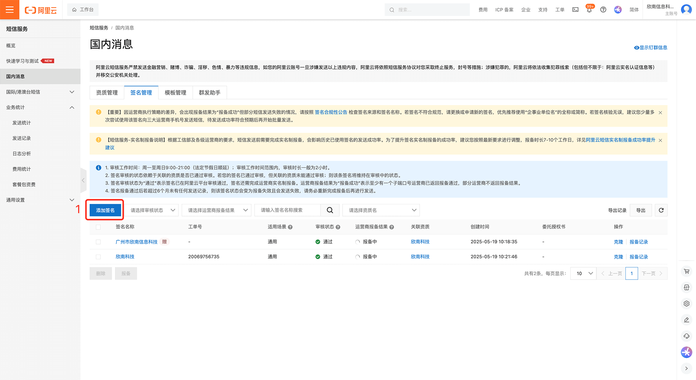
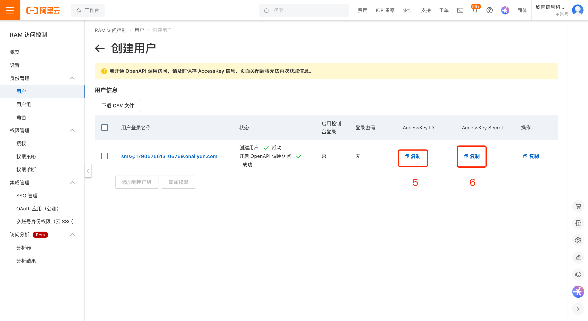
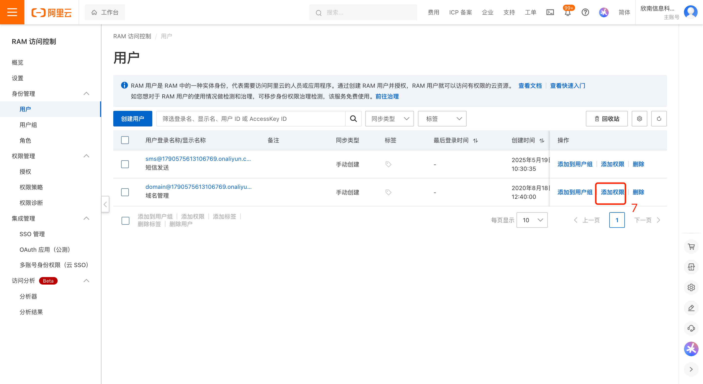
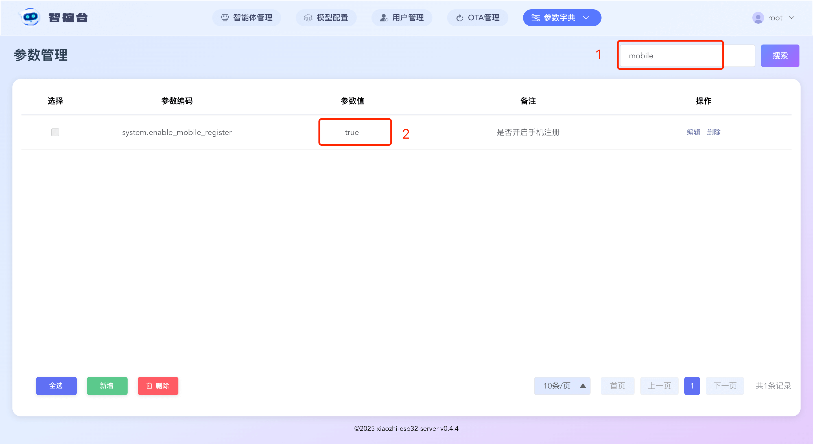

# Alibaba Cloud SMS Integration Guide

Log in to the Alibaba Cloud Console and open the "SMS Service" page: https://dysms.console.aliyun.com/overview

## Step 1 — Add a Signature

After completing the steps above you will get a *Sign Name*. Copy that value into the Admin Console parameter: `aliyun.sms.sign_name`.

**Note:** SMS signatures require carrier approval and may take up to 7 business days. SMS messages cannot be sent until the signature is approved.

## Step 2 — Add a Template

After completing this step you will get a *Template Code*. Copy that into the Admin Console parameter: `aliyun.sms.sms_code_template_code`.

## Step 3 — Create an Access Account and Grant Permissions

Open Alibaba Cloud Console → Access Control (RAM): https://ram.console.aliyun.com/overview?activeTab=overview

After completing these steps you will obtain an `access_key_id` and `access_key_secret`. Enter them in the Admin Console parameters:

- `aliyun.sms.access_key_id`
- `aliyun.sms.access_key_secret`

## Step 4 — Enable Mobile Registration

1. After the previous steps are completed and the signature is approved, you should see the registration UI working. If it does not work, double-check the previous steps.

2. Allow user registration: Set `server.allow_user_register` → `true`.

3. Enable mobile registration: Set `server.enable_mobile_register` → `true`.

---

If you want, I can also add a short checklist or example `.config.yaml` snippet showing where to put these parameters. Would you like that?