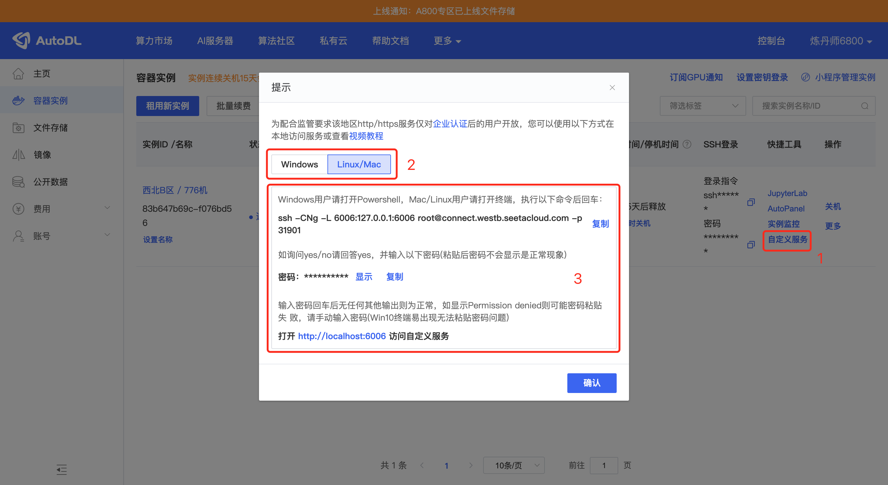

# FishSpeech Integration (AutoDL)

1. Log in to AutoDL and lease a machine image.

Choose the image:

```
PyTorch / 2.1.0 / 3.10 (ubuntu22.04) / cuda 12.1
```

2. After the machine starts, enable the academic network acceleration:

```bash
source /etc/network_turbo
```

3. Enter the working directory:

```bash
cd autodl-tmp/
```

4. Clone the FishSpeech project and enter it:

```bash
git clone https://gitclone.com/github.com/fishaudio/fish-speech.git ; cd fish-speech
```

5. Install dependencies:

```bash
pip install -e .
```

If the install fails, install PortAudio first:

```bash
apt-get install portaudio19-dev -y
```

Then re-run the PyTorch install with the CUDA wheel (example):

```bash
pip install torch==2.3.1 torchvision==0.18.1 torchaudio==2.3.1 --index-url https://download.pytorch.org/whl/cu121
```

6. Download the models:

```bash
cd tools
python download_models.py
```

7. Start the API server:

```bash
python -m tools.api_server --listen 0.0.0.0:6006
```

8. In the AutoDL console, open the Instances page:

```
https://autodl.com/console/instance/list
```

Click the **Custom Service** button for your machine and enable port forwarding for the service.



After port forwarding is configured, open the FishSpeech API from your local machine:

```
http://localhost:6006/
```


9. Example single-module configuration (if you deploy as a single module):

```yaml
selected_module:
  TTS: FishSpeech
TTS:
  FishSpeech:
    reference_audio: ["config/assets/wakeup_words.wav"]
    reference_text: ["哈啰啊，我是小智啦，声音好听的台湾女孩一枚，超开心认识你耶，最近在忙啥，别忘了给我来点有趣的料哦，我超爱听八卦的啦"]
    api_key: "123"
    api_url: "http://127.0.0.1:6006/v1/tts"
```

10. Restart the service after configuration changes.

---

*This is an English translation of `docs/fish-speech-integration.md`. The original file remains unchanged.*