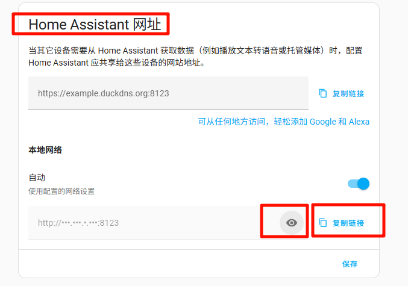
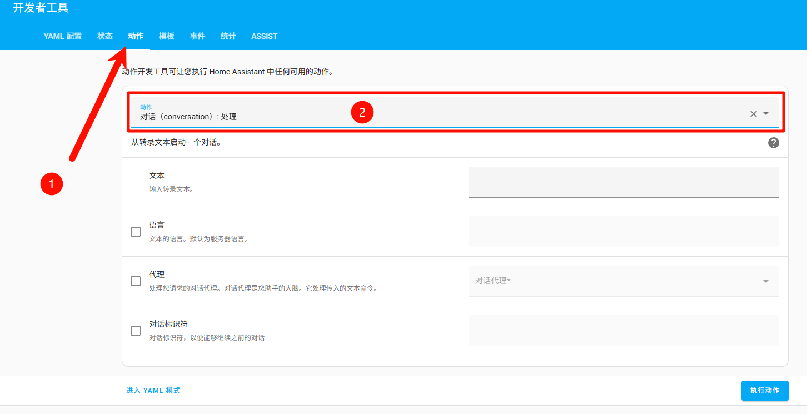

# XiaoZhi ESP32 — Integration Guide with Home Assistant

[TOC]

-----

## Overview

This document guides you through integrating ESP32 devices with Home Assistant (HA).

## Prerequisites

- Home Assistant is installed and reachable on your network.
- In the examples in this guide, I use the free ChatGLM model which supports function_call (function invocation) features.

## Preliminary steps (required)

### 1. Obtain Home Assistant’s network address

Open your Home Assistant in a browser, for example if your HA host is 192.168.4.7 and the default port is 8123, open:

```
http://192.168.4.7:8123
```

> How to manually find HA’s IP address (only valid when `xiaozhi-esp32-server` and Home Assistant are on the same network device, e.g. same WLAN):
>
> 1. Open the Home Assistant frontend.
> 2. Go to **Settings → System → Network**.
> 3. Scroll to the bottom to the **Home Assistant website** area, and in **Local network** click the eye icon to see the current IP and interface (e.g. `192.168.1.10`). Use **Copy link** to copy the address.
>
> 

Alternatively, if you have already set up a DNS or mDNS name for Home Assistant, you can use it directly:

```
http://homeassistant.local:8123
```

### 2. Get a long-lived access token (developer API key)

Log in to Home Assistant, click your profile avatar (bottom-left) → **Personal** → **Security** tab, then generate a Long-Lived Access Token (LLAT) and save it. You will need this API key for the steps below. Tip: you can save the scanned QR code image and extract the token later.

## Method 1 — Community-driven HA integration (recommended for simple setups)

### What this method does

- When you add or change devices, you must manually restart the `xiaozhi-esp32-server` service to refresh the device list (important).
- This method assumes you already have the Xiaomi Home integration in Home Assistant and your Mi devices are imported into HA.
- Your `xiaozhi-esp32-server` management console must be working.
- Example: in my environment `xiaozhi-esp32-server` and Home Assistant are on the same host (different ports), server version `0.3.10`:

```
http://192.168.4.7:8002
```

### Configuration steps

#### 1. Collect the devices you want to control in Home Assistant

In Home Assistant go to **Settings → Devices & Services → Entities** and search for the switches or devices you want to control.

Click an entity from the results to open its control panel, and confirm the switch responds when you toggle it — this verifies connectivity.

Open the entity’s settings to find its **entity identifier** (entity_id). Create a simple text list using the format:

Location,Device name,entity_id;

Example:

```
office,toy_light,switch.cuco_cn_460494544_cp1_on_p_2_1;
```

If you have two devices:

```
office,toy_light,switch.cuco_cn_460494544_cp1_on_p_2_1;
office,desk_lamp,switch.iot_cn_831898993_socn1_on_p_2_1;
```

Save this text — it will be pasted into the XiaoZhi management console configuration as the “device list string.”

#### 2. Configure XiaoZhi Management Console (智控台)

Log in to the management console with an administrator account. Go to **Agent Management**, pick your agent, and click **Configure Roles**.

Set intent recognition to either **External model intent recognition** or **LLM function_call**. Click **Edit Functions** on the right to open the Function Management dialog.

In Function Management, enable **HomeAssistant device status query** and **HomeAssistant device status modify**.

Click the selected function (e.g., **HomeAssistant device status query**) and enter the Home Assistant address, your API key (long-lived token), and the device list string you prepared earlier. Save the configuration and then save the agent’s configuration.

After configuration is saved, try waking the device and issue voice commands (for example, “Turn on the XXX light”).

#### 3. Test voice control

Say “Turn on XXX light” to the ESP32 and verify the action executes in Home Assistant.

## Method 2 — Use Home Assistant’s Voice Assistant as an LLM tool

### What this method does

- Drawback: using Home Assistant’s voice assistant as the LLM tool hands intent recognition to Home Assistant, which means XiaoZhi’s built-in function_call plugin capability will not be available.
- Benefit: you get native Home Assistant functionality while maintaining XiaoZhi’s chat capability.
- If you want both native HA features and XiaoZhi’s function_call support, consider Method 3 (HA MCP service) instead.

### Configuration steps

#### 1. Configure a voice assistant (LLM) in Home Assistant

Make sure you have Home Assistant’s voice assistant or a large-model integration configured and working in HA.

#### 2. Obtain the Home Assistant agent ID for the voice assistant

1. In Home Assistant, open **Developer Tools** on the left menu.
2. Switch to the **Actions** tab, choose the service `conversation.process` (Conversation: Process).



3. Enable the **Agent** (conversation agent) option and select the voice assistant agent you configured (e.g., `ZhipuAi`).


4. Click **Enter YAML mode** at the bottom-left of the form.


5. Copy the `agent_id` value from the YAML (example: `01JP2DYMBDF7F4ZA2DMCF2AGX2`).


6. In `xiaozhi-esp32-server`’s `config.yaml`, under the LLM configuration, add Home Assistant with its network address, the API key (long-lived token), and the `agent_id` you copied.
7. Set `selected_module: LLM` to `HomeAssistant` and `Intent` to `nointent` in `config.yaml`.
8. Restart `xiaozhi-esp32-server` to apply the configuration.

## Method 3 — Use Home Assistant’s MCP service (recommended)

### What this method does

- Requires the Home Assistant integration **Model Context Protocol Server (mcp_server)** to be installed in HA.
- Unlike Method 2, this method allows you to keep XiaoZhi’s function_call capability while accessing native Home Assistant features. It is the recommended approach if you want both.

### Configuration steps

#### 1. Install the MCP Server integration in Home Assistant

Official docs: [Model Context Protocol Server](https://www.home-assistant.io/integrations/mcp_server/)

Alternatively, add it from **Settings → Devices & Services → Add Integration** and select **Model Context Protocol Server** from the list, then follow the on-screen installation steps.

#### 2. Configure the MCP proxy settings for XiaoZhi

In your `data` directory, find `.mcp_server_settings.json`.

If you don’t have `.mcp_server_settings.json` in your `data` folder, either:

- Copy `mcp_server_settings.json` from the project root (`main/xiaozhi-server/mcp_server_settings.json`) to `data` and rename it to `.mcp_server_settings.json`, or
- Download it from the repo and place it in `data` as `.mcp_server_settings.json`.

Edit the `"mcpServers"` entry and add the Home Assistant configuration like this:

```json
"Home Assistant": {
      "command": "mcp-proxy",
      "args": [
        "http://YOUR_HA_HOST/mcp_server/sse"
      ],
      "env": {
        "API_ACCESS_TOKEN": "YOUR_API_ACCESS_TOKEN"
      }
},
```

Notes:

1. Replace `YOUR_HA_HOST` in `args` with your HA host (if your host already includes `http://` or `https://`, you can provide just the host with port, e.g. `192.168.1.101:8123`).
2. Replace `YOUR_API_ACCESS_TOKEN` with your Home Assistant long-lived access token.
3. If this entry is the last item inside `"mcpServers"`, remove the trailing comma to avoid JSON parse errors.

Example final structure:

```json
"mcpServers": {
  "Home Assistant": {
    "command": "mcp-proxy",
    "args": [
      "http://192.168.1.101:8123/mcp_server/sse"
    ],
    "env": {
      "API_ACCESS_TOKEN": "abcd.efghi.jkl"
    }
  }
}
```

#### 3. Configure XiaoZhi server system settings

1. Choose any LLM model that supports `function_call` to serve as XiaoZhi’s LLM assistant (do not select Home Assistant itself as the LLM tool). In this document I used the free ChatGLM as an example; for more stability consider `DoubaoLLM` with `model_name: doubao-1-5-pro-32k-250115`.
2. In `xiaozhi-esp32-server`'s `config.yaml` set your LLM configuration and set `selected_module: Intent` to `function_call`.
3. Restart `xiaozhi-esp32-server`.

---

*This is an English translation of `docs/homeassistant-integration.md`. The original file remains unchanged.*