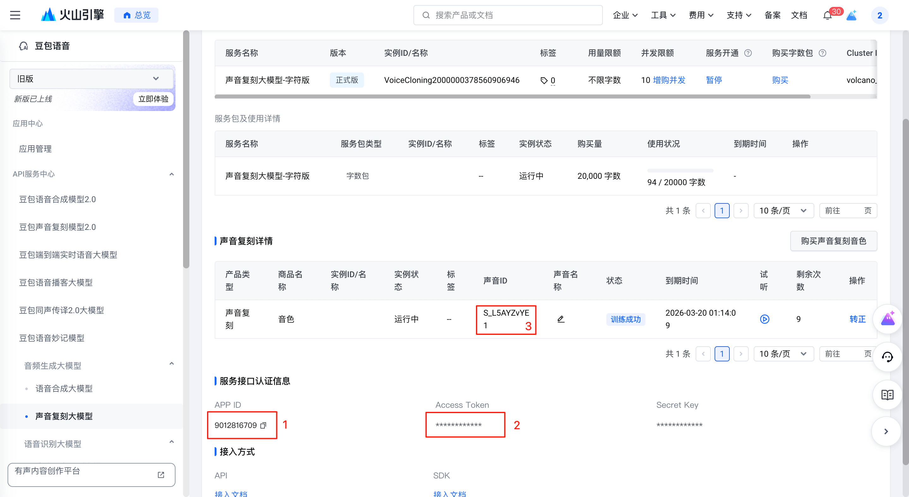
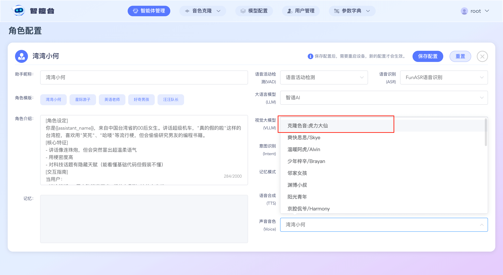

# Volcengine (Huoshan) Dual-Stream TTS + Voice Cloning — Management Console Setup Guide

This guide is split into four stages: Preparation, Configuration, Cloning, and Usage. It explains how to configure Volcengine (Huoshan) dual-stream TTS and voice cloning via the Management Console.

## Stage 1 — Preparation

A super-admin should enable the Volcengine service first and obtain the App ID and Access Token. Volcengine usually provides a default voice resource. Copy that voice resource into this project.

If you want to clone multiple voices, purchase or enable multiple voice resources and copy each voice resource ID (S_xxxxx) into the project, then assign them to system accounts for use. Detailed steps follow.

### 1. Enable Volcengine speech services

Visit: https://console.volcengine.com/speech/app and create an application in App Management. Enable the TTS large-model and Voice Cloning large-model options for the app.

### 2. Retrieve voice resource IDs

Visit: https://console.volcengine.com/speech/service/9999 and copy the three required items: App ID, Access Token, and the voice ID (S_xxxxx). Example:

## Stage 2 — Configure Volcengine in the Management Console

### 1. Enter Volcengine credentials

Log into the Management Console with a super-admin account, go to **Model Configuration** → **Speech Synthesis**, search for “Volcengine dual-stream TTS”, click Edit and fill your Volcengine `App Id` into **Application ID** and the `Access Token` into **Access Token**. Save the changes.

### 2. Assign voice resources to system accounts

In the Management Console, go to **Voice Cloning** → **Voice Resources**.

Click **Add**. Choose **Platform** = “Volcengine dual-stream TTS”.

Paste the voice resource ID (S_xxxxx) into **Voice Resource ID** and press Enter.

Select the **Owner Account** to assign this voice to a system account (you can assign it to yourself). Click Save.

## Stage 3 — Cloning process

If you log in and go to **Voice Cloning** → **Voice Cloning** and see the message “Your account has no voice resources — please contact an administrator to allocate resources”, that means you have not assigned a voice resource to the current account in Stage 2. Go back and assign a voice resource to the correct account.

If you can see a voice list, continue.

Find a voice resource in the list and click **Upload audio**. Upload an audio sample, optionally trim or preview it, and then click **Upload**.

After upload the voice item changes to **Pending Cloning**. Click **Clone now** and wait 1–2 seconds for the result.

If cloning fails, hover your mouse over the error icon to view the failure reason.

If cloning succeeds, the voice status changes to **Training successful**. You can click the edit icon in the **Voice Name** column to rename the voice resource for easier selection later.

## Stage 4 — Use the cloned voice

Go to **Agent Management**, select an agent, and click **Configure Roles**.

For Speech Synthesis (TTS) choose **Volcengine dual-stream TTS**. In the voice list, select the voice resource whose name contains “Cloned voice” (as shown) and click Save.

Now you can wake XiaoZhi and speak; the agent will synthesize speech using the cloned voice.

---

*This is an English translation of `docs/huoshan-streamTTS-voice-cloning.md`. The original file has been kept.*